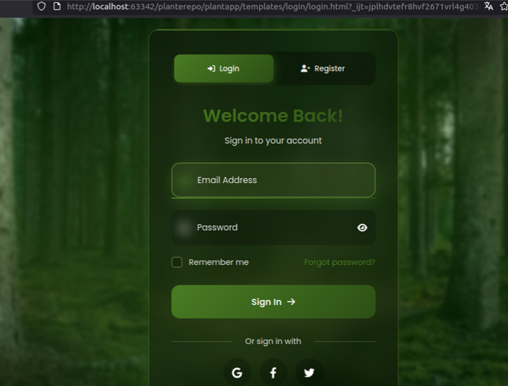
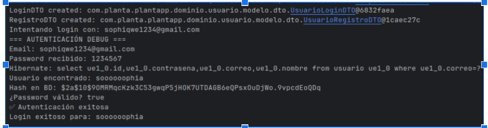
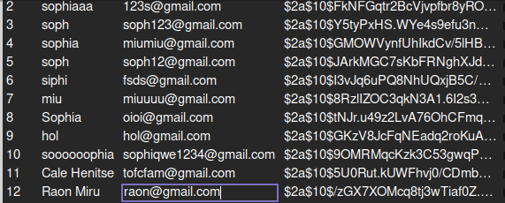

# 🌿 PlantApp - Sistema de Gestión de Plantas (Java + DDD)

## 📌 Descripción del Proyecto

PlantApp es un sistema de gestión de usuarios, plantas y recordatorios implementado en Java siguiendo los principios de **Domain-Driven Design (DDD)** y una arquitectura por capas.

Este proyecto incluye:

- Modelado de entidades centrales: `Usuario`, `Planta`, `Cuidado`, `Recordatorio`.
- Fábricas especializadas para instanciar objetos del dominio.
- Repositorios con contratos definidos para persistencia.
- Validaciones de reglas de negocio en la capa de aplicación.

El desarrollo se realizó en **IntelliJ IDEA**, siguiendo principios de arquitectura limpia.

---

## 🛠️ Estructura del Proyecto

```bash
src/
└── main/
    ├── java/
    │   └── com/planta/plantapp/
    │       ├── aplicacion/
    │       │   ├── interfaces/
    │       │   │   └── IServicioUsuario.java
    │       │   └── servicios/
    │       │       └── ServicioUsuarioImpl.java
    │       ├── dominio/
    │       │   └── usuario/
    │       │       ├── IUsuarioRepositorio.java
    │       │       └── modelo/
    │       │           └── Usuario.java
    │       ├── infraestructura/
    │       │   ├── entidad/
    │       │   │   └── UsuarioEntidad.java
    │       │   └── repositorio/
    │       │       └── mysql/
    │       │           └── UsuarioRepositorioImpl.java
    │       └── presentacion/
    │           └── controlador/
    │               └── UsuarioController.java
    └── resources/
        ├── static/
        │   └── login/
        │       ├── css/
        │       │   └── styles.css
        │       └── js/
        │           └── script.js
        └── templates/
            └── login/
                └── login.html
````

---

## 🎨 Interfaz de Usuario

Capturas de pantalla del sistema:

* Pantalla de inicio de sesión
* Pantalla de registro de usuario
* Registro e inicio de sesion conectado a base de datos.
* Encriptacion de contraseña.







**Dashboard Principal**
- Vista general con estadísticas
- Plantas que requieren atención
  

**Mis Plantas**
- Lista de plantas personales del usuario
- Estados actuales
- Opciones de edición y eliminación
- 


**Registro de Nueva Planta**
- Selección desde catálogo
- Personalización con apodo y ubicación
- Configuración de estado inicial
  


---

## ✅ Módulo: Registro e Inicio de Sesión Seguro

### 🎯 Objetivo

Permitir que los usuarios se registren e inicien sesión de manera segura, implementando validaciones, persistencia y protección de credenciales.

---

## 📝 Historias de Usuario Cubiertas

### 🟢 H.2.1.1 - Validar Datos del Formulario

| Tarea                                                     | Estado       |
| --------------------------------------------------------- | ------------ |
| Diseñar formulario con campos: nombre, correo, contraseña | ✅ Completado |
| Validar formato de correo                                 | ✅ Completado |
| Validar seguridad de contraseña                           | ✅ Completado |
| Mostrar mensajes de error al usuario                      | ✅ Completado |

### 🟢 H.2.1.2 - Guardar Usuario y Encriptar Contraseña

| Tarea                               | Estado       |
| ----------------------------------- | ------------ |
| Configurar conexión a MySQL         | ✅ Completado |
| Almacenar datos en tabla `usuarios` | ✅ Completado |
| Evitar contraseñas en texto plano   | ✅ Completado |

### 🔜 H.2.1.3 - Verificación por correo (Próximamente)

---

## 🔐 Seguridad en el Manejo de Credenciales

| Tarea                                                      | Estado       |
| ---------------------------------------------------------- | ------------ |
| Detectar credenciales visibles                             | ✅ Completado |
| Reemplazar por variables de entorno (`DB_USER`, `DB_PASS`) | ✅ Completado |
| Validar almacenamiento seguro de contraseñas               | ✅ Completado |

---

### 🟢 **Módulo: Gestión de Plantas Personales**

| Funcionalidad | Estado | Descripción |
|---------------|--------|-------------|
| Registrar planta personal | ✅ | Agregar planta desde catálogo |
| Listar mis plantas | ✅ | Ver plantas del usuario |
| Editar información de planta | ✅ | Modificar apodo, ubicación, estado |
| Eliminar planta | ✅ | Remover planta del sistema |
| Cambiar estado de planta | ✅ | Actualizar condición actual |

### 🟢 **Módulo: Dashboard y Reportes**

| Funcionalidad | Estado | Descripción |
|---------------|--------|-------------|
| Dashboard interactivo | ✅ | Vista general del sistema |
| Estadísticas por usuario | ✅ | Contadores y métricas |
| API REST completa | ✅ | Endpoints para todas las operaciones |

---

## 💡 Estilos de Programación Aplicados

### 1. Trinity (Entrada → Procesamiento → Salida)

Separación clara entre:

* **Entrada**: Datos recibidos desde `@RequestParam` en el `Controller`.
* **Procesamiento**: Lógica delegada a la capa de aplicación (`usuarioServicio`).
* **Salida**: Respuesta al cliente (mensaje textual o estado HTTP).

```java
@PostMapping("/login")
public String autenticarUsuario(@RequestParam String email,
                                @RequestParam String contrasena) {
    Usuario usuario = usuarioServicio.autenticarUsuario(email, contrasena);
    return (usuario != null) ? "Inicio de sesión exitoso" : "Credenciales incorrectas";
}
```

---

### 2. Things (Modelo Rico del Dominio)

El objeto `Usuario` representa una entidad del dominio con identidad, atributos y relaciones:

```java
public class Usuario {
    private Long id;
    private String nombre;
    private String correo;
    private List<Planta> plantas;
}
```

---

### 3. Pipeline (Procesamiento Paso a Paso)

Estilo aplicado en métodos como `registrarUsuario`, donde los datos fluyen en una secuencia:

**Ejemplo:**

```java
public void registrarUsuario(Usuario usuario) {
    if (usuario == null || usuario.getCorreo() == null)
        throw new IllegalArgumentException("Datos inválidos");

    Optional<Usuario> existente = repositorioUsuario.buscarPorCorreo(usuario.getCorreo());
    if (existente.isPresent())
        throw new IllegalArgumentException("Correo ya registrado");

    repositorioUsuario.guardar(usuario);
}
```

Secuencia:

1. Validación
2. Verificación
3. Ejecución
4. Resultado

---

### 4. Error Handling (Manejo de Errores)

Captura controlada de excepciones para mantener robustez del sistema:

```java
@Override
    public boolean actualizarPerfil(Usuario usuario) {
        if (usuario == null || usuario.getId() == null) return false;

        try {
            repositorioUsuario.guardar(usuario);
            return true;
        } catch (Exception e) {
            e.printStackTrace();
            return false;
        }
```

### Cookbook

Aplicación de **procedimientos secuenciales** que modifican estado compartido.

```java
// Cookbook: Estado compartido modificado por procedimientos
private List<String> erroresValidacion = new ArrayList<>();
private Planta plantaEnProceso;
private boolean procesoCompletado = false;

public boolean registrarNuevaPlanta(String nombre, String tipo, String usuarioId) {
    // Paso 1: Limpiar estado previo
    limpiarEstadoProceso();
    
    // Paso 2: Validar datos de entrada
    validarDatosEntrada(nombre, tipo, usuarioId);
    
    // Paso 3: Normalizar y preparar datos
    prepararDatosPlanta(nombre, tipo);
    
    // Paso 4: Ejecutar guardado si todo está correcto
    if (erroresValidacion.isEmpty()) {
        ejecutarGuardado(usuarioId);
    }
    
    return procesoCompletado;
}
```

###  Pipeline

Uso del **API Stream de Java** para construir cadenas de procesamiento donde los datos fluyen a través de filtros, mapeos y transformaciones.

```java
// Pipeline: transformaciones encadenadas sin estado compartido
public List<PlantaResumenDTO> obtenerTodas() {
    return plantaRepositorio.listarTodos()
        .stream()
        .filter(planta -> planta != null && planta.getEstado() != null)
        .filter(planta -> !"ELIMINADA".equals(planta.getEstado()))
        .map(this::transformarAResumen)
        .sorted((p1, p2) -> p1.getNombre().compareTo(p2.getNombre()))
        .limit(100)
        .collect(Collectors.toList());
}
```

###  Persistent Tables

Implementación de **estructura tabular** con queries declarativas, simulando el comportamiento de una base de datos relacional.

```java
// Persistent Tables: simulación de tablas relacionales
private final Map<String, Usuario> tablaUsuarios;
private final Map<String, String> indiceCorreos; // correo -> id

@Override
public Optional<Usuario> buscarPorCorreo(String correo) {
    // Query declarativa: SELECT * FROM usuarios WHERE email = ?
    if (correo == null || !correo.contains("@")) {
        return Optional.empty();
    }
    
    String usuarioId = indiceCorreos.get(correo.toLowerCase());
    if (usuarioId != null) {
        return Optional.ofNullable(tablaUsuarios.get(usuarioId));
    }
    
    return Optional.empty();
}
```

###  Error / Exception Handling

**Validación rigurosa** de parámetros y captura controlada de excepciones para mantener la robustez del sistema.

```java
// Error Handling: validación defensiva y manejo controlado
@Override
public Planta obtenerPorId(String id) {
    if (id == null || id.trim().isEmpty()) {
        throw new IllegalArgumentException("ID no puede ser nulo o vacío");
    }
    
    try {
        // TODO: Implementar consulta MongoDB real
        return null; // Temporal hasta completar implementación
    } catch (Exception e) {
        throw new RuntimeException("Error al consultar planta con ID: " + id, e);
    }
}
```

#### **Programación Declarativa (Spring Annotations)**
```java
@Service
@Repository
@Controller
@RequestMapping("/web")
```

Prácticas aplicadas:

* Validación previa con `IllegalArgumentException`
* Manejo de fallos inesperados con `try-catch`
* Propagación controlada con `IllegalStateException`


#### **Pipeline (Funcional)**
```java
return plantaMongoRepo.findAll()
    .stream()
    .filter(p -> p.getTipo().equalsIgnoreCase(tipo))
    .map(this::convertirADominio)
    .collect(Collectors.toList());
```

#### **Cookbook (Funciones con estado compartido)**
```java
@Service
public class CatalogoService {
    private List<Planta> catalogo; // Estado compartido
    
    public void inicializarCatalogo() { /* función modifica estado */ }
    public List<Planta> obtenerCatalogo() { /* función lee estado */ }
}
```

#### **Things (Objetos con identidad)**
```java
@Document(collection = "registros_plantas")
public class RegistroPlanta {
    @Id
    private String id; // Identidad única
    private String apodo;
    private EstadoPlanta estado;
}

## 🔍 Análisis Estático SonarLint/SonarQube

Durante el desarrollo, se utilizaron herramientas como **SonarLint** para realizar análisis estático y mejorar la calidad del código. A continuación, se documenta una de las recomendaciones aplicadas:

### 🟡 Recomendación: Evitar uso directo de `Boolean` boxeado en expresiones booleanas

**Mensaje de SonarLint:**

> Avoid using boxed "Boolean" types directly in boolean expressions.

**Descripción:**
El uso de objetos `Boolean` en condiciones puede lanzar una excepción `NullPointerException` si el valor es `null`. La conversión automática (unboxing) falla silenciosamente. Es mejor verificar explícitamente si el valor no es `null`.

**❌ Código no conforme:**

```java
Boolean activo = usuario.getActivo();
if (activo) {  // ❌ Posible NullPointerException
    ...
}
```

**✅ Código corregido:**

```java
Boolean activo = usuario.getActivo();
if (Boolean.TRUE.equals(activo)) {
    ...
}
```


# PlantApp - Análisis Técnico y Arquitectónico

## 📊 Evaluación Técnica

---

### 2. Prácticas de Codificación Limpia (3/3 puntos) ✅

Implementa **más de 5 prácticas de Clean Code**:

#### **Nombres Descriptivos**
```java
private static final String ATTR_LOGIN_DTO = "loginDTO";
private static final String ATTR_REGISTRO_DTO = "registroDTO";
private static final String LOGIN_VIEW = "login/login";
```

#### **Funciones Pequeñas y con Una Responsabilidad**
```java
@GetMapping("/login")
public String mostrarLogin(Model model) {
    logger.debug("Cargando formulario de login");
    model.addAttribute(ATTR_LOGIN_DTO, new UsuarioLoginDTO());
    model.addAttribute(ATTR_REGISTRO_DTO, new UsuarioRegistroDTO());
    return LOGIN_VIEW;
}
```

#### **Manejo de Errores con Logging**
```java
} catch (Exception e) {
    logger.error("Error al registrar usuario: {}", e.getMessage());
    model.addAttribute("error", "Error al registrar usuario");
    return LOGIN_VIEW;
}
```

#### **Eliminación de Código Duplicado (DRY)**
```java
private void agregarDTOsAlModelo(Model model) {
    model.addAttribute(ATTR_LOGIN_DTO, new UsuarioLoginDTO());
    model.addAttribute(ATTR_REGISTRO_DTO, new UsuarioRegistroDTO());
}
```

#### **Constantes en lugar de Magic Numbers/Strings**
```java
private static final Logger logger = LoggerFactory.getLogger(UsuarioWebController.class);
private static final String ATTR_USUARIO_NOMBRE = "usuarioNombre";
```

#### **Validación de Entrada**
```java
public void setCorreo(String correo) {
    this.correo = correo != null ? correo.trim() : null;
}
```

---

### 3. Principios SOLID (3/3 puntos) ✅

Implementa **más de 3 principios SOLID**:

#### **S - Single Responsibility Principle**
Cada clase tiene una única responsabilidad:
- `ServicioAutenticacionImpl`: Solo autenticación
- `UsuarioRepositorioImpl`: Solo persistencia de datos
- `UsuarioWebController`: Solo manejo de peticiones web

#### **O - Open/Closed Principle**
```java
public interface IServicioUsuario {
    void registrarUsuario(Usuario usuario);
    // Abierto para extensión, cerrado para modificación
}

@Service
public class ServicioUsuarioImpl implements IServicioUsuario {
    // Implementación específica
}
```

#### **L - Liskov Substitution Principle**
```java
IServicioUsuario usuarioServicio; // Puede ser cualquier implementación
IServicioAutenticacion autenticacionServicio; // Intercambiable
```

#### **I - Interface Segregation Principle**
Interfaces específicas y cohesivas:
```java
public interface IServicioAutenticacion {
    Usuario autenticar(String correo, String password); // Solo autenticación
}

public interface IUsuarioRepositorio {
    Usuario obtenerPorId(String id);
    Optional<Usuario> buscarPorCorreo(String correo);
    // Solo operaciones de repositorio
}
```

#### **D - Dependency Inversion Principle**
```java
public class ServicioAutenticacionImpl implements IServicioAutenticacion {
    private final IUsuarioRepositorio usuarioRepositorio; // Depende de abstracción
    private final PasswordEncoder passwordEncoder;        // No de implementación concreta
    
    public ServicioAutenticacionImpl(IUsuarioRepositorio usuarioRepositorio,
                                   PasswordEncoder passwordEncoder) {
        this.usuarioRepositorio = usuarioRepositorio;
        this.passwordEncoder = passwordEncoder;
    }
}
```

---

### 4. Domain-Driven Design (3/3 puntos) ✅

Implementa **todos los elementos DDD**:

#### **Entidades**
```java
public class Usuario {
    private Long id; // Identidad única
    private String nombre;
    private String correo;
    
    @Override
    public boolean equals(Object o) {
        if (this == o) return true;
        if (!(o instanceof Usuario)) return false;
        Usuario usuario = (Usuario) o;
        return Objects.equals(id, usuario.id); // Identidad por ID
    }
}
```

#### **Objetos de Valor (Value Objects)**
```java
public class UsuarioLoginDTO {
    private String correo;
    private String contrasena;
    // Sin identidad propia, inmutable en comportamiento
}

public class UsuarioRegistroDTO {
    private String nombre;
    private String correo;
    private String contrasena;
}
```

#### **Servicios de Dominio**
```java
@Service
public class ServicioAutenticacionImpl implements IServicioAutenticacion {
    @Override
    public Usuario autenticar(String correo, String password) {
        // Lógica de negocio compleja que no pertenece a una entidad
    }
}
```

#### **Repositorios**
```java
public interface IUsuarioRepositorio {
    Usuario obtenerPorId(String id);
    Optional<Usuario> buscarPorCorreo(String correo);
    void guardar(Usuario usuario);
    void eliminar(String id);
}

@Repository
public class UsuarioRepositorioImpl implements IUsuarioRepositorio {
    // Implementación específica de persistencia
}
```

#### **Módulos (Packages)**
```
com.planta.plantapp.dominio.usuario.modelo     // Entidades
com.planta.plantapp.aplicacion.servicios       // Servicios de aplicación
com.planta.plantapp.infraestructura.repositorio // Repositorios
com.planta.plantapp.presentacion.controlador   // Controladores
```

#### **Fábricas (Implícitas)**
```java
// Constructor actúa como factory method
public Usuario(String nombre, String correo, String contrasena) {
    this.nombre = nombre;
    this.correo = correo;
    this.contrasena = contrasena;
}
```

---

### 5. Estilos/Patrones de Arquitectura (3/3 puntos) ✅

Implementa **Arquitectura en Capas con Repositorio**:

#### **Capa de Presentación**
```java
@Controller
@RequestMapping("/web")
public class UsuarioWebController {
    // Maneja peticiones HTTP, vistas Thymeleaf
}

@RestController
@RequestMapping("/usuarios")
public class UsuarioController {
    // API REST para servicios externos
}
```

#### **Capa de Aplicación**
```java
@Service
public class ServicioUsuarioImpl implements IServicioUsuario {
    // Orquesta casos de uso y lógica de aplicación
}

@Service
public class ServicioAutenticacionImpl implements IServicioAutenticacion {
    // Casos de uso específicos de autenticación
}
```

#### **Capa de Dominio**
```java
public class Usuario {
    // Entidad de dominio pura
}

public interface IUsuarioRepositorio {
    // Contrato del dominio para persistencia
}
```

#### **Capa de Infraestructura/Repositorio**
```java
@Repository
public class UsuarioRepositorioImpl implements IUsuarioRepositorio {
    private final UsuarioJpaRepositorio usuarioJpaRepositorio;
    // Implementación específica con JPA/Hibernate
}
```

---

## 🏗️ Patrones de Diseño Identificados

### **Repository Pattern**
```java
public interface IUsuarioRepositorio {
    Optional<Usuario> buscarPorCorreo(String correo);
}

@Repository
public class UsuarioRepositorioImpl implements IUsuarioRepositorio {
    // Encapsula lógica de acceso a datos
}
```

### **Dependency Injection**
```java
public ServicioAutenticacionImpl(IUsuarioRepositorio usuarioRepositorio,
                               PasswordEncoder passwordEncoder) {
    this.usuarioRepositorio = usuarioRepositorio;
    this.passwordEncoder = passwordEncoder;
}
```

### **Data Transfer Object (DTO)**
```java
public class UsuarioLoginDTO {
    private String correo;
    private String contrasena;
    // Transfiere datos entre capas
}
```

### **MVC (Model-View-Controller)**
```java
@Controller // Controlador
public class UsuarioWebController {
    public String mostrarLogin(Model model) { // Modelo
        return "login/login"; // Vista
    }
}
```

## 🚀 Fortalezas del Proyecto

1. **Arquitectura Sólida**: Separación clara de responsabilidades en capas
2. **Seguridad**: Implementación correcta de BCrypt para contraseñas
3. **Logging**: Sistema robusto de trazabilidad con SLF4J
4. **Validación**: Manejo apropiado de errores y validaciones
5. **Testabilidad**: Alto desacoplamiento facilita testing
6. **Escalabilidad**: Estructura preparada para crecimiento

